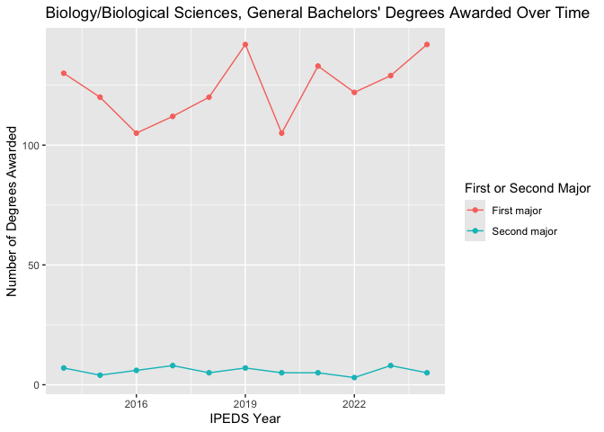

<!-- README.md is generated from README.Rmd. Please edit that file -->

# sharedgovernance

<!-- badges: start -->

<!-- badges: end -->

In an academic institution, many people participate in decision-making:
the governing board, administrators, faculty, staff, students, and
others. See [AAUP’s
FAQ](https://www.aaup.org/issues-higher-education/shared-governance/faqs-shared-governance)
for more information. Good decisions come from informed people, and yet
sometimes information is not available to everyone involved or is
heavily curated before release. This package aggregates information from
the federal IPEDS databases, College Scorecard, and other sources,
generally as organized by the
[collegetables.info](https://collegetables.info) site (which I also
run), and organizes it in ways that lets community members all have free
access to it. A common use case will be when there are discussions on
the need to close departments. Faculty arguments often focus on
qualitative factors, which can be powerful (“what does it mean for how
much we value STEM if one cannot get a PhD in math anywhere in the
state?”) but having quantitative arguments can also help. Alternatively,
a broader look at the data could argue that some closures do make sense.

Note I am doing this as a hobby on my own time – nothing here reflects
the views or work for any past, current, or future employer, nor of any
organization. I’m just trying to save colleagues work when a new
question arises.

Some caveats: this uses federal data and thus reflects the federal
government’s views on demographic categories. The data are mostly
analyzed with R scripts at
<https://github.com/bomeara/collegetables_source> with some minor
tweaking in this package – I’ve tried to be careful with all the coding,
but there could be errors, especially comparing across years. For much
of the original data, go to <https://nces.ed.gov/ipeds/> and
<https://collegescorecard.ed.gov/data/>. For comparisons to a focal
school, I use the schools that focal school chooses as comparisons and
the schools NCES uses as comparisons. **If you see any issues, please
add them to <https://github.com/bomeara/sharedgovernance/issues> or,
even better, fix them and use a pull request.**

## Installation

You can install the development version of sharedgovernance from
[GitHub](https://github.com/) with:

``` r
# install.packages("pak")
pak::pak("bomeara/sharedgovernance")
```

Note that some of the functions may take some time to run – it can be
doing operations across hundreds of thousands of rows (all majors by all
degrees by all years by all institutions makes for a lot of data).

## Example

Imagine we wanted to look into U. of Nebraska, Lincoln. First we have to
find its ID number in the federal data. We find names that are closest
to it (in this case, the punctuation used is slightly different, but it
still finds it). Make sure to use the full name: “University of
Nebraska, Lincoln” rather than (“U Nebraska Lincoln” or “UNL”). By
default it prints out the top ten matches.

``` r
library(sharedgovernance)
id <- sg_find_college("University of Nebraska, Lincoln")
#>                      Institution entity name distances
#> 181464        University of Nebraska-Lincoln         2
#> 181394       University of Nebraska at Omaha         9
#> 181215     University of Nebraska at Kearney        10
#> 182290             University of Nevada-Reno        11
#> 102553        University of Alaska Anchorage        12
#> 122436               University of San Diego        12
#> 154095           University of Northern Iowa        12
#> 181428 University of Nebraska Medical Center        12
#> 215929                University of Scranton        12
#> 232681         University of Mary Washington        12
```

We can look at average salaries of graduates for the focal institution
(listed first by default) and its comparison institutions.

``` r
grad_salaries <- sg_compare_field_salaries(id)
print(head(grad_salaries))
#>        UNITID                    Institution
#> 101728 181464 University of Nebraska-Lincoln
#> 101729 181464 University of Nebraska-Lincoln
#> 101731 181464 University of Nebraska-Lincoln
#> 101734 181464 University of Nebraska-Lincoln
#> 101737 181464 University of Nebraska-Lincoln
#> 101740 181464 University of Nebraska-Lincoln
#>                                                           Field     Degree
#> 101728                                              Agriculture  Bachelors
#> 101729                                              Agriculture    Masters
#> 101731                     Agricultural Business and Management  Bachelors
#> 101734                               Agricultural Mechanization  Bachelors
#> 101737                       Agricultural Production Operations Associates
#> 101740 Applied Horticulture and Horticultural Business Services  Bachelors
#>        Earnings.1.year.all Earnings.5.year.all Earnings.1.year.men
#> 101728               43669                  NA                  NA
#> 101729               50894                  NA                  NA
#> 101731               53229               60418               54837
#> 101734               59052               74776                  NA
#> 101737               24427               41932                  NA
#> 101740               46289               56741                  NA
#>        Earnings.1.year.women Earnings.5.year.men Earnings.5.year.women focal
#> 101728                    NA                  NA                    NA  TRUE
#> 101729                    NA                  NA                    NA  TRUE
#> 101731                 46235               65132                 55662  TRUE
#> 101734                    NA                  NA                    NA  TRUE
#> 101737                    NA                  NA                    NA  TRUE
#> 101740                    NA                  NA                    NA  TRUE
```

We can also look at number of degrees awarded over time.

``` r
completions <- sg_return_graduates(id)
print(head(dplyr::select(completions, Institution, Classification, Degree, `Year`, `Grand total`),40))
#>                         Institution    Classification    Degree Year
#> 86   University of Nebraska-Lincoln        Accounting Bachelors 2014
#> 87   University of Nebraska-Lincoln        Accounting Bachelors 2014
#> 146  University of Nebraska-Lincoln        Accounting Bachelors 2015
#> 147  University of Nebraska-Lincoln        Accounting Bachelors 2015
#> 207  University of Nebraska-Lincoln        Accounting Bachelors 2016
#> 208  University of Nebraska-Lincoln        Accounting Bachelors 2016
#> 269  University of Nebraska-Lincoln        Accounting Bachelors 2017
#> 270  University of Nebraska-Lincoln        Accounting Bachelors 2017
#> 330  University of Nebraska-Lincoln        Accounting Bachelors 2018
#> 331  University of Nebraska-Lincoln        Accounting Bachelors 2018
#> 390  University of Nebraska-Lincoln        Accounting Bachelors 2019
#> 391  University of Nebraska-Lincoln        Accounting Bachelors 2019
#> 454  University of Nebraska-Lincoln        Accounting Bachelors 2020
#> 455  University of Nebraska-Lincoln        Accounting Bachelors 2020
#> 518  University of Nebraska-Lincoln        Accounting Bachelors 2021
#> 519  University of Nebraska-Lincoln        Accounting Bachelors 2021
#> 581  University of Nebraska-Lincoln        Accounting Bachelors 2022
#> 582  University of Nebraska-Lincoln        Accounting Bachelors 2022
#> 641  University of Nebraska-Lincoln        Accounting Bachelors 2023
#> 642  University of Nebraska-Lincoln        Accounting Bachelors 2023
#> 702  University of Nebraska-Lincoln        Accounting Bachelors 2024
#> 934  University of Nebraska-Lincoln        Accounting   Masters 2014
#> 977  University of Nebraska-Lincoln        Accounting   Masters 2015
#> 1022 University of Nebraska-Lincoln        Accounting   Masters 2016
#> 1067 University of Nebraska-Lincoln        Accounting   Masters 2017
#> 1112 University of Nebraska-Lincoln        Accounting   Masters 2018
#> 1156 University of Nebraska-Lincoln        Accounting   Masters 2019
#> 1199 University of Nebraska-Lincoln        Accounting   Masters 2020
#> 1242 University of Nebraska-Lincoln        Accounting   Masters 2021
#> 1286 University of Nebraska-Lincoln        Accounting   Masters 2022
#> 1328 University of Nebraska-Lincoln        Accounting   Masters 2023
#> 1368 University of Nebraska-Lincoln        Accounting   Masters 2024
#> 1556 University of Nebraska-Lincoln            Acting Bachelors 2022
#> 1563 University of Nebraska-Lincoln            Acting Bachelors 2023
#> 1570 University of Nebraska-Lincoln            Acting Bachelors 2024
#> 1602 University of Nebraska-Lincoln Actuarial Science Bachelors 2014
#> 1603 University of Nebraska-Lincoln Actuarial Science Bachelors 2014
#> 1617 University of Nebraska-Lincoln Actuarial Science Bachelors 2015
#> 1618 University of Nebraska-Lincoln Actuarial Science Bachelors 2015
#> 1634 University of Nebraska-Lincoln Actuarial Science Bachelors 2016
#>      Grand total
#> 86           111
#> 87            10
#> 146           99
#> 147           12
#> 207          108
#> 208           11
#> 269          143
#> 270           12
#> 330          135
#> 331            9
#> 390          134
#> 391           11
#> 454          131
#> 455            9
#> 518          115
#> 519            7
#> 581          122
#> 582           10
#> 641          123
#> 642           15
#> 702           43
#> 934           31
#> 977           34
#> 1022          36
#> 1067          47
#> 1112          42
#> 1156          46
#> 1199          45
#> 1242          31
#> 1286          39
#> 1328          45
#> 1368          14
#> 1556           0
#> 1563           0
#> 1570           0
#> 1602          48
#> 1603           0
#> 1617          51
#> 1618           0
#> 1634          72
```

These are just data.frames. We can export them to CSV files (i.e.,
`write.csv(completions, file="completions.csv")`) if analyzing them in
Excel, Google Sheets, or another program is preferred. But we can also
analyze them in R. For example, we can plot the number of Bachelors’
degrees in ‘Biology/Biological Sciences, General’ over time for the
focal institution and its comparisons.

``` r
library(ggplot2)
library(dplyr)
#> 
#> Attaching package: 'dplyr'
#> The following objects are masked from 'package:stats':
#> 
#>     filter, lag
#> The following objects are masked from 'package:base':
#> 
#>     intersect, setdiff, setequal, union
bio_degrees <- completions |> dplyr::filter(Classification=="Biology/Biological Sciences, General", Degree=="Bachelors", focal==TRUE)
g <- ggplot(bio_degrees, aes(x=`Year`, y=`Grand total`, color=`First or Second Major`)) +
  geom_line() +
  geom_point() +
  labs(title="Biology/Biological Sciences, General Bachelors' Degrees Awarded Over Time",
       y="Number of Degrees Awarded",
       x="IPEDS Year")
print(g)
```


